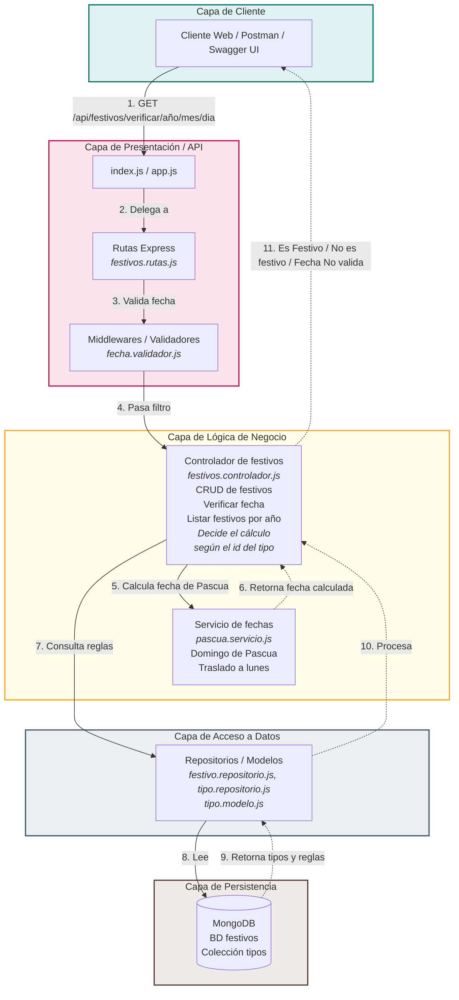

# Diagrama de arquitectura — API Festivos

Arquitectura por capas de la API Festivos (Express JS + MongoDB).

```mermaid
graph TD
    %% Cliente / Capa de Presentación Externa
    subgraph ClientLayer [Capa de Cliente]
        Client[Cliente Web / Postman / Swagger UI]
    end

    %% Capa de Entrada y Enrutamiento
    subgraph PresentationLayer [Capa de Presentación / API]
        Index[index.js / app.js]
        Routes[Rutas Express<br/><i>festivos.rutas.js</i>]
        Validators[Middlewares / Validadores<br/><i>fecha.validador.js</i>]
    end

    %% Capa de Lógica de Negocio
    subgraph BusinessLayer [Capa de Lógica de Negocio]
        Controllers[Controlador de festivos<br/><i>festivos.controlador.js</i><br/>CRUD de festivos<br/>Verificar fecha<br/>Listar festivos por año<br/><i>Decide el cálculo</i><br/><i>según el id del tipo</i>]
        DateService[Servicio de fechas<br/><i>pascua.servicio.js</i><br/>Domingo de Pascua<br/>Traslado a lunes]
    end

    %% Capa de Acceso a Datos
    subgraph DataAccessLayer [Capa de Acceso a Datos]
        Repositories[Repositorios / Modelos<br/><i>festivo.repositorio.js, tipo.repositorio.js</i><br/><i>tipo.modelo.js</i>]
    end

    %% Capa de Persistencia
    subgraph PersistenceLayer [Capa de Persistencia]
        DB[(MongoDB<br/>BD festivos<br/>Colección tipos)]
    end

    %% Flujo de la Petición (Request)
    Client -->|1. GET /api/festivos/verificar/año/mes/dia| Index
    Index -->|2. Delega a| Routes
    Routes -->|3. Valida fecha| Validators
    Validators -->|4. Pasa filtro| Controllers
    Controllers -->|5. Calcula fecha de Pascua| DateService
    DateService -.->|6. Retorna fecha calculada| Controllers
    Controllers -->|7. Consulta reglas| Repositories
    Repositories -->|8. Lee| DB

    %% Flujo de la Respuesta (Response)
    DB -.->|9. Retorna tipos y reglas| Repositories
    Repositories -.->|10. Procesa| Controllers
    Controllers -.->|11. Es Festivo / No es festivo / Fecha No valida| Client

    %% Enlace invisible: ubica la capa de acceso a datos debajo de la capa de negocio
    DateService ~~~ Repositories

    %% Estilos de Nodos
    style ClientLayer fill:#e0f2f1,stroke:#00796b,stroke-width:2px
    style PresentationLayer fill:#fce4ec,stroke:#c2185b,stroke-width:2px
    style BusinessLayer fill:#fffde7,stroke:#f9a825,stroke-width:2px
    style DataAccessLayer fill:#eceff1,stroke:#455a64,stroke-width:2px
    style PersistenceLayer fill:#efebe9,stroke:#5d4037,stroke-width:2px
```
