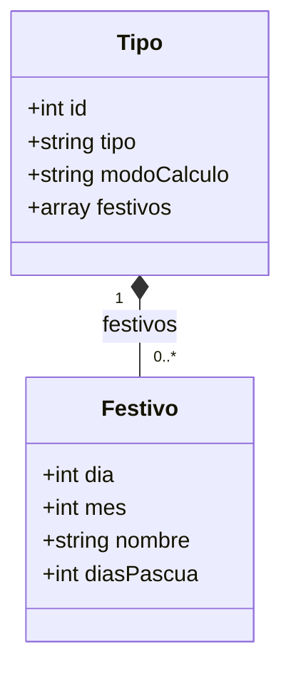

# Diagrama objetual — Base de datos Festivos (MongoDB)

Colección `tipos`: cada documento Tipo contiene un vector embebido de objetos Festivo.

```mermaid
classDiagram
    class Tipo {
        +int id
        +string tipo
        +string modoCalculo
        +array festivos
    }

    class Festivo {
        +int dia
        +int mes
        +string nombre
        +int diasPascua
    }

    Tipo "1" *-- "0..*" Festivo : festivos
```
